# KAVEN

**KAVEN — Korean AI-based Vigilance for Event Navigation**

AIS(해상)·ADS-B(항공)·뉴스·소셜 데이터를 수집하고, LLM 분석과 중복 제거를 거쳐
severity(1–5) 이벤트를 생성하는 **지정학 조기경보 시스템**입니다.
텔레그램 경보, Palantir 스타일 웹 작전 콘솔(Ops Console), 그리고
AI 에이전트 연동(MCP + REST)을 제공합니다.

현재 버전: **0.0.14** · 변경 이력: [`docs/release-notes.md`](docs/release-notes.md) · 라이선스: MIT

---

## 화면 (Ops Console)

> 지도는 **내장 벡터 월드맵**(Natural Earth 110m + 로컬 번들 Leaflet)으로
> 렌더링됩니다 — CDN·타일 서버 없이 오프라인에서도 항상 동일하게 동작합니다.

**COP (Common Operating Picture)** — 벡터 월드맵 + 감시구역 오버레이 + severity 마커 + 24시간 타임라인 + 지역 도시에(7일 스파크라인):

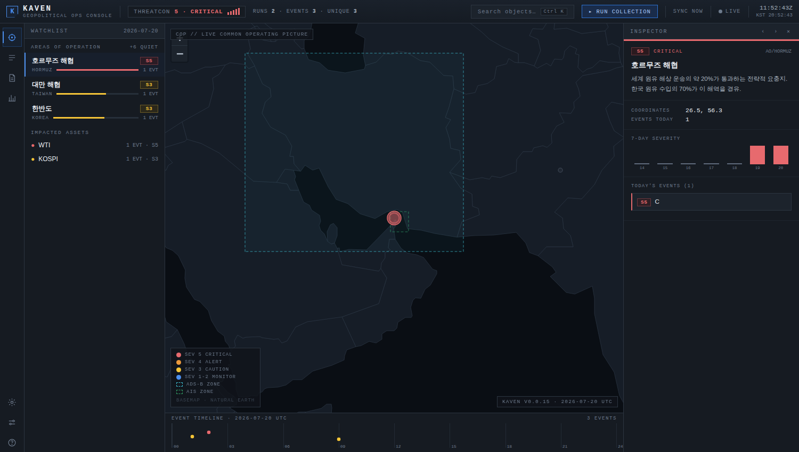

**AO 줌** — 감시구역 확대 (한반도 ADS-B 구역 + S5 이벤트 마커):

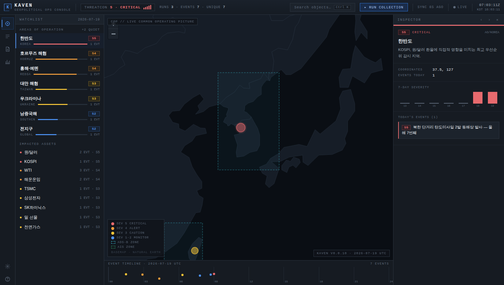

**Event Feed** — 필터·정렬 가능한 이벤트 트리아지 테이블 + 인스펙터(분석 근거·영향 자산·출처):

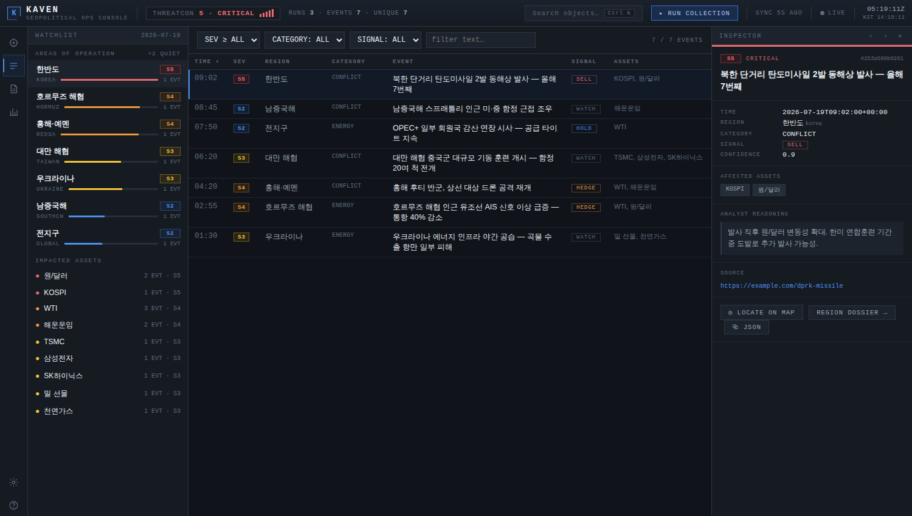

| Intel Report | Asset Impact |
|---|---|
| 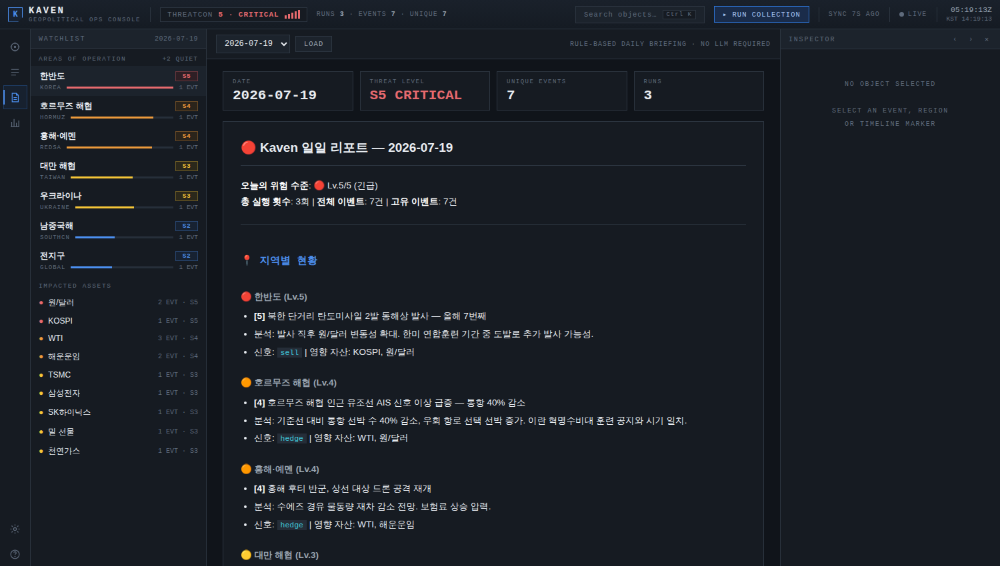 | 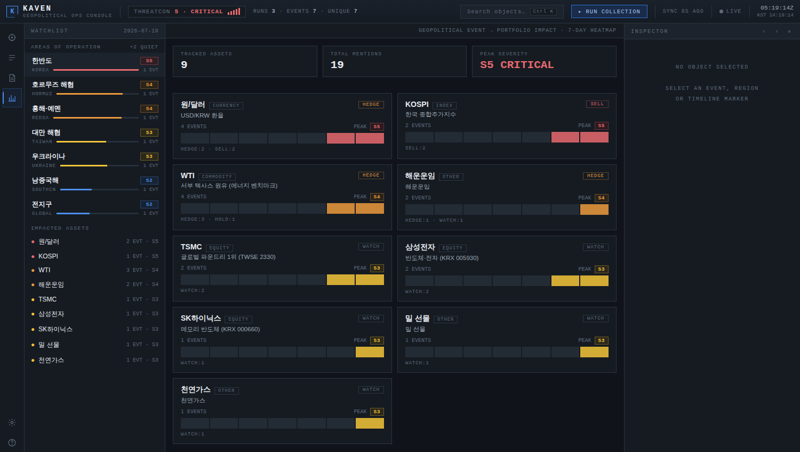 |
| 규칙 기반 일일 브리핑 (LLM/API 키 불필요) | 자산별 7일 severity 히트맵 + 신호 분포 |

| Command Palette (`Ctrl+K`) | System / Collection |
|---|---|
| 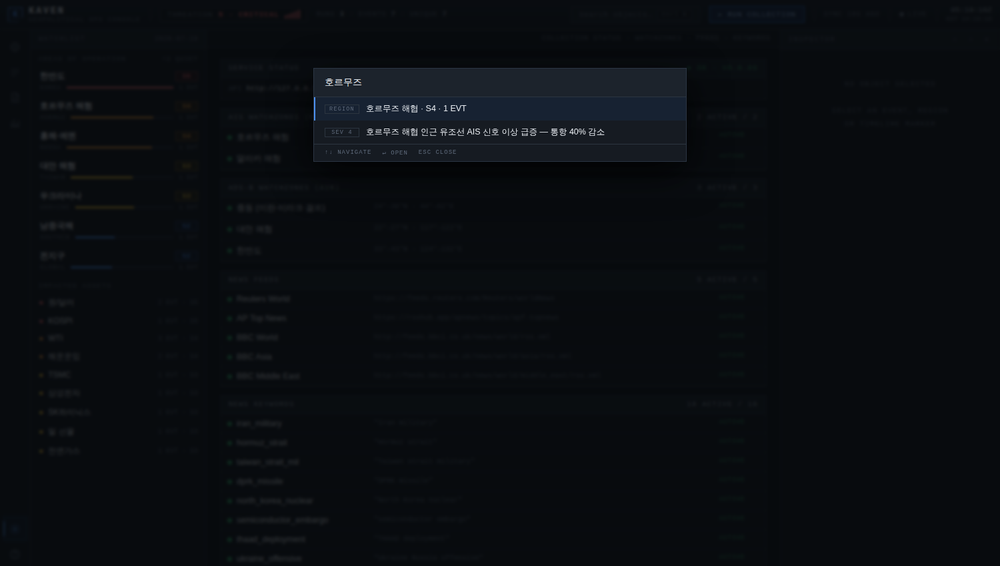 | 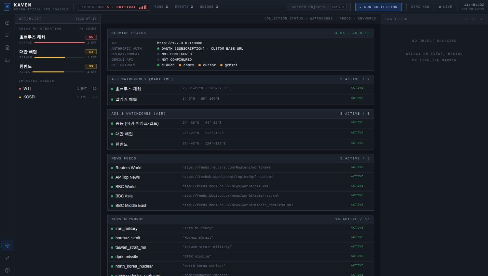 |
| 지역·이벤트·자산·뷰·액션 통합 검색 | 감시구역/피드/키워드 수집 상태 보드 |

**Settings — zcode 스타일 설정 콘솔** (좌측 내비: 콘솔/모델/수집·데이터 그룹, 선택 탭 유지):

| Settings — 모델 공급자 (구독/OAuth) | Settings — 일반·콘솔 환경설정 |
|---|---|
| 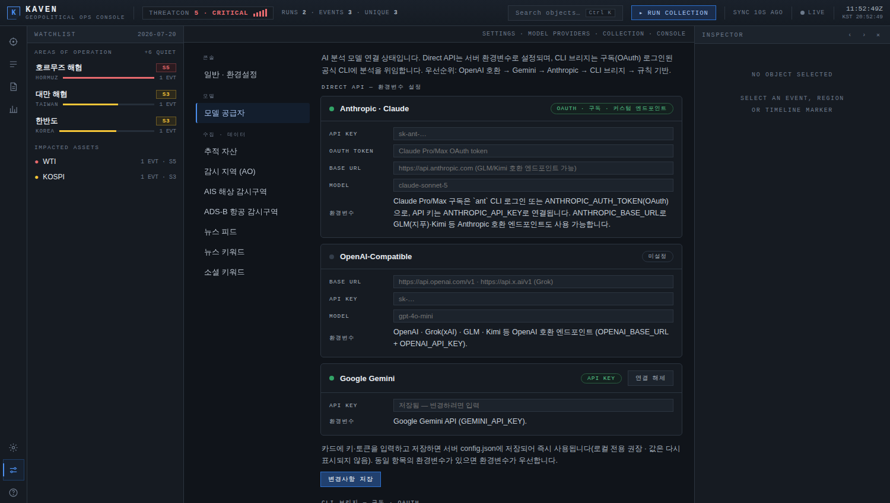 | 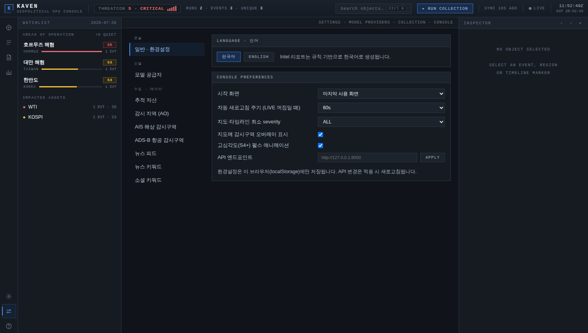 |
| 공급자 카드: OAuth·구독/API Key 상태 배지, 설치됨/미설치 상태 점, CLI 브리지 인라인 편집·추가·해제 | 언어 전환 + 시작 화면·새로고침 주기·지도 severity·오버레이·펄스·API 주소 |

| Settings — 수집 설정 편집 | COP — English mode |
|---|---|
| 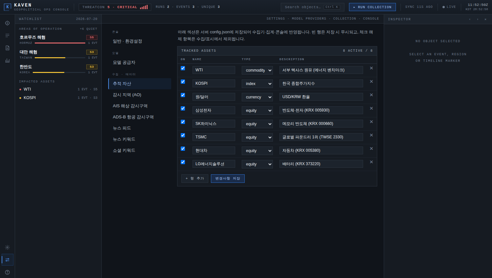 | 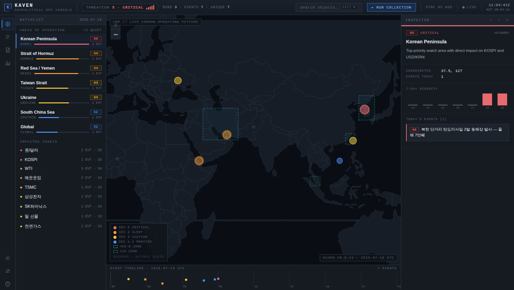 |
| 자산/지역/감시구역/피드/키워드 전 섹션 인라인 편집 → `config.json` 저장 | 언어 전환 시 지역명·설명·도움말이 영어로 표시 |

**키보드 단축키** — `?` 키로 콘솔 안에서 언제든 확인:

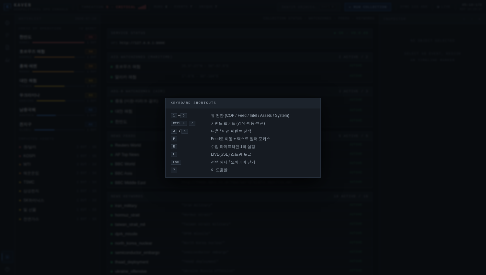

---

## 목차

1. [주요 기능](#1-주요-기능)
2. [시스템 아키텍처](#2-시스템-아키텍처)
3. [빠른 시작](#3-빠른-시작)
4. [웹 작전 콘솔](#4-웹-작전-콘솔)
5. [AI 에이전트 연동](#5-ai-에이전트-연동)
6. [설정](#6-설정)
7. [API 요약](#7-api-요약)
8. [프로젝트 구조](#8-프로젝트-구조)
9. [테스트](#9-테스트)
10. [운영 / 트러블슈팅](#10-운영--트러블슈팅)
11. [문서·기여·라이선스](#11-문서기여라이선스)

---

## 1) 주요 기능

- **4채널 수집** — AIS 선박(호르무즈·말라카 등), ADS-B 항공(중동·대만·한반도),
  뉴스 RSS(Reuters/AP/BBC + SearxNG), 소셜 검색. 감시구역·피드·키워드는
  전부 설정 파일로 관리하며 항목별 `enabled` 토글 지원.
- **LLM 분석 + 규칙 폴백** — OpenAI 호환(로컬 LLM 포함) → Gemini → Anthropic
  (API 키 또는 **구독 OAuth**) → **CLI 구독 브리지**(Claude Code/Codex/
  Cursor Agent/Gemini CLI) → 규칙 기반 순서로 폴백. 출력: `event`,
  `severity(1-5)`, `category`, `signal`, `confidence`, `affected_assets`,
  `source_url` 등.
- **구독(OAuth) 모델 연결** — API 키 없이 Claude Pro/Max·ChatGPT Plus/Pro·
  Cursor·Google 계정 구독으로 분석 모델 사용 (§3.3). GLM(지푸)·Kimi는
  호환 엔드포인트로 지원.
- **입력 기준 중복 제거** — 새 자극(신규 뉴스 URL, AIS/ADS-B anomaly)이 없으면
  LLM 호출·발송 자체를 스킵. 텍스트/수치/URL 유사도 기반 이벤트 병합.
- **텔레그램 경보** — severity 기준 발송, 긴급(5) 별도 헤더.
- **웹 작전 콘솔** — 다중 패널 인텔리전스 콘솔(위 스크린샷). 실시간 SSE,
  키보드 중심 운용, 상태 지속성(localStorage), **한국어/영어 전환**,
  **추적 자산 커스터마이징**(Settings 뷰에서 편집 → `config.json` 저장).
- **AI 에이전트 연동** — 의존성 없는 stdio MCP 서버(도구 8개) + `/agent/*` REST.
  에이전트가 상황 요약·이벤트 쿼리·LLM 브리핑을 도구로 소비 가능.
- **일일 리포트** — JSONL 로그에서 규칙 기반으로 지역/카테고리/자산 집계 +
  마크다운 브리핑 자동 생성 (API 키 불필요).
- **로컬 우선 저장** — JSONL 로그가 원본. 외부 전송(Convex)은 `CONVEX_SITE_URL`
  명시 설정 시에만 opt-in (이슈 #7 정책).

## 2) 시스템 아키텍처

```
┌─ 수집(collectors) ─────────────┐
│ AIS │ ADS-B │ News │ Social    │   config.json (감시구역/피드/키워드, enabled 토글)
└──────────────┬─────────────────┘
               ▼
      입력 게이팅 (새 자극 없으면 스킵)
               ▼
┌─ 분석(analyzer) ───────────────┐
│ OpenAI호환 → Gemini → Anthropic│ → 규칙 기반 폴백
└──────────────┬─────────────────┘
               ▼
      중복 제거(dedup) → severity 이벤트
               ▼
┌──────────────┼───────────────────────────┐
▼              ▼                           ▼
텔레그램 경보   JSONL 로그 (로컬 원본)      Convex 업로드(opt-in)
               │
               ▼  src/kaven/ 코어 (log_store · ops_summary · aggregates · agent_service)
     ┌─────────┴──────────┐
     ▼                    ▼
 FastAPI 웹 API      MCP 서버 (stdio)
 (webapp/backend)    (python -m src.kaven.mcp_server)
     ▼                    ▼
 Ops Console SPA      AI 에이전트 (Claude Code / Desktop 등)
```

- 도메인 로직은 전부 `src/kaven/` 코어에 있고, 웹 라우터와 MCP 서버는 얇은
  어댑터 계층입니다. 같은 함수가 HTTP와 MCP 양쪽에서 재사용됩니다.

## 3) 빠른 시작

### 3.1 설치

```bash
python3 -m venv .venv
source .venv/bin/activate
pip install -U pip
pip install -r requirements.txt          # 운영
pip install -r requirements-dev.txt      # 개발(+pytest/ruff/mypy)
```

### 3.2 `.env` 준비 (선택)

Kaven은 `src/kaven/.env`를 자동 로드합니다. **모든 키는 선택**이며, 없으면
시뮬레이션/비인증/규칙 기반 모드로 동작합니다.

```bash
cat > src/kaven/.env <<'ENV'
# ===== 수집 =====
OPENSKY_CLIENT_ID=
OPENSKY_CLIENT_SECRET=
AISSTREAM_API_KEY=
SEARXNG_URL=http://localhost:8080

# ===== 분석 (하나만 있어도 됨; 없으면 구독 CLI → 규칙 기반) =====
OPENAI_BASE_URL=
OPENAI_API_KEY=
OPENAI_MODEL=
GEMINI_API_KEY=
ANTHROPIC_API_KEY=
# 구독(OAuth) — API 키 대신 (§3.3): ANTHROPIC_AUTH_TOKEN 또는 `ant auth login`
ANTHROPIC_AUTH_TOKEN=
ANTHROPIC_BASE_URL=
ANTHROPIC_MODEL=

# ===== 알림 =====
TELEGRAM_BOT_TOKEN=
TELEGRAM_CHAT_ID=
TELEGRAM_TOPIC_MAVEN=
TELEGRAM_USER_DM=

# ===== 원격 백업 (opt-in — 미설정 시 외부 전송 완전 비활성) =====
CONVEX_SITE_URL=
CONVEX_EVENT_PATH=/addKavenRun
ENV
```

> 보안: `.env`는 절대 커밋하지 마세요. `CONVEX_SITE_URL` 미설정 시 이벤트는
> 어떤 외부 엔드포인트로도 전송되지 않습니다.

### 3.3 구독(OAuth)으로 모델 연결 — API 키 없이

API 키 대신 **이미 쓰고 있는 구독**으로 분석 모델을 연결할 수 있습니다.
모든 키·토큰·엔드포인트는 환경변수 대신 **콘솔 Settings → 모델 공급자
카드에서 직접 입력·저장**할 수도 있습니다 (`config.json`에 저장, 동일 항목의
환경변수가 있으면 환경변수 우선, 연결 해제 버튼으로 삭제).

**Anthropic 직접 연결** (우선순위: `ANTHROPIC_API_KEY` → OAuth):

| 구독 | 방법 |
|---|---|
| Claude Pro/Max | `ant auth login` 한 번이면 끝 — Kaven이 `ant` CLI 프로필에서 단기 토큰을 자동 발급 (또는 `ANTHROPIC_AUTH_TOKEN`에 OAuth 토큰 직접 지정) |
| GLM (지푸/Z.ai) | `ANTHROPIC_BASE_URL=https://open.bigmodel.cn/api/anthropic` + 구독 키 |
| Kimi (Moonshot) | `ANTHROPIC_BASE_URL=https://api.moonshot.ai/anthropic` + 구독 키 |

모델은 `ANTHROPIC_MODEL`로 지정 (기본 `claude-sonnet-5`).

**CLI 구독 브리지** — 로그인된 공식 CLI에 분석 프롬프트를 위임합니다.
설치·로그인만 되어 있으면 자동 감지되며, Settings → 모델 공급자에서
활성/비활성·명령 편집·커스텀 공급자 추가가 가능합니다:

| 구독 | CLI | 기본 명령 |
|---|---|---|
| Claude Pro/Max | Claude Code | `claude -p --output-format text` |
| ChatGPT Plus/Pro | OpenAI Codex | `codex exec` |
| Cursor | Cursor Agent | `cursor-agent -p --output-format text` |
| Google 계정 | Gemini CLI | `gemini -p` |

`KAVEN_CLI_PROVIDER`로 특정 브리지만 사용(`id`)하거나 전체 비활성(`off`)할 수
있습니다. Grok 등 공식 API 구독 경로가 없는 서비스도 해당 CLI가 있다면
커스텀 공급자로 등록해 쓸 수 있습니다 (Grok은 xAI API 키를
`OPENAI_BASE_URL=https://api.x.ai/v1`로 연결하는 방법도 있음).

연결 상태는 콘솔 **Settings → 모델 공급자** 또는 `GET /health`의
`analysis` 필드에서 확인합니다 (비밀값은 노출되지 않음).

### 3.4 수집 파이프라인 실행

```bash
python src/kaven/kaven.py --once            # 1회 실행
python src/kaven/kaven.py --watch           # 감시 모드 (기본 5분)
python src/kaven/kaven.py --watch --interval 10
```

## 4) 웹 작전 콘솔

### 4.1 실행

```bash
# 백엔드 (FastAPI)
uvicorn webapp.backend.app:app --reload --port 8000

# 프론트엔드 (정적 파일)
python -m http.server 8080 --directory webapp/frontend
```

접속: `http://127.0.0.1:8080` — API 주소가 다르면 `?api=http://호스트:8000`으로 override.

### 4.2 화면 구성

| 뷰 | 내용 |
|---|---|
| **COP** | 내장 벡터 월드맵(Natural Earth, 오프라인 동작) 위 감시구역 박스·severity 마커·펄스 링 + 24h 이벤트 타임라인 |
| **Event Feed** | severity/카테고리/신호/텍스트 필터 + Time/Sev 정렬 테이블 |
| **Intel Report** | 일일 브리핑 마크다운 (날짜 선택) |
| **Asset Impact** | 자산별 7일 severity 히트맵 + 신호 분포 |
| **System** | 수집 파이프라인/감시구역/피드/키워드 상태 보드 |
| **Settings** | zcode 스타일 좌측 내비(콘솔/모델/수집 그룹): 언어·콘솔 환경설정 + **모델 공급자 패널**(Direct API 키·토큰 카드 입력/연결 해제 + CLI 구독 브리지 편집) + 서버 설정 전 섹션 편집기(자산/감시지역/AIS·ADS-B 구역/뉴스 피드/키워드 → `config.json` 저장) |

공통: 좌측 AO 워치리스트(S0 지역은 `+n QUIET` 접기, 자산 클릭 → Feed 필터),
우측 인스펙터(이벤트 상세·지역 도시에·7일 스파크라인·JSON 복사),
상단 THREATCON·SYNC 신선도·UTC/KST 시계·LIVE(SSE) 토글.

### 4.3 키보드 단축키

| 키 | 동작 |
|---|---|
| `1`–`6` | 뷰 전환 (COP / Feed / Intel / Assets / System / Settings) |
| `Ctrl+K`, `/` | 커맨드 팔레트 (검색·이동·액션) |
| `J` / `K` | 다음 / 이전 이벤트 선택 |
| `F` | Feed 이동 + 텍스트 필터 포커스 |
| `R` | 수집 파이프라인 1회 실행 |
| `L` | LIVE(SSE) 스트림 토글 |
| `Esc` | 선택 해제 / 오버레이 닫기 |
| `?` | 단축키 도움말 |

뷰·필터·정렬·LIVE 상태·언어는 localStorage에 저장되어 새로고침 후 복원됩니다.

### 4.4 언어 (한국어 / English)

- Settings 뷰(단축키 `6`) 또는 커맨드 팔레트의 "Toggle language"로 전환.
- 전환 시 지역명·지역 설명·도움말·툴팁·설정 라벨이 해당 언어로 표시됩니다
  (콘솔 크롬의 mono 레이블은 디자인상 양쪽 모두 영문 유지).
- Intel 리포트는 규칙 기반으로 한국어로 생성됩니다.

## 5) AI 에이전트 연동

### 5.1 MCP 서버 (권장)

외부 SDK 의존성 없는 stdio MCP 서버를 내장합니다. 로그 디렉터리만 읽으므로
API 키 없이 동작합니다(`kaven_run_collection` 제외).

```bash
# Claude Code (저장소 루트에서)
claude mcp add kaven -- python -m src.kaven.mcp_server
```

```json
// claude_desktop_config.json
{
  "mcpServers": {
    "kaven": {
      "command": "python",
      "args": ["-m", "src.kaven.mcp_server"],
      "cwd": "/path/to/kaven"
    }
  }
}
```

| 도구 | 설명 |
|---|---|
| `kaven_ops_summary` | 통합 상황 요약 (위협 수준·지역·이벤트·자산·감시구역) |
| `kaven_events` | 평탄화 이벤트 쿼리 (severity/지역/카테고리/신호/키워드 필터) |
| `kaven_agent_context` | LLM 프롬프트 주입용 압축 마크다운 브리핑 |
| `kaven_region` | 지역 상세 + 최근 N일 severity 히스토리 |
| `kaven_daily_report` | 규칙 기반 일일 브리핑 (마크다운) |
| `kaven_portfolio` | 자산별 투자 영향 집계 |
| `kaven_config` | 수집 설정 조회 |
| `kaven_run_collection` | 수집 파이프라인 1회 즉시 실행 |

### 5.2 REST

```bash
curl http://127.0.0.1:8000/agent/manifest                          # 디스커버리 카탈로그
curl "http://127.0.0.1:8000/agent/context?severity_min=3"          # LLM 브리핑
curl "http://127.0.0.1:8000/agent/events?region=korea&severity_min=4"
```

이벤트 스키마 어휘(지역 코드·카테고리·신호·severity 의미)는
`/agent/manifest`의 `vocabulary` 필드를 참조하세요.
콘솔의 커맨드 팔레트에도 "Copy ops briefing (LLM context)" 액션이 있습니다.

## 6) 설정

### 6.1 감시구역/피드/키워드 (`config.json`)

탐색 순서: `KAVEN_CONFIG` 환경변수 경로 → `src/kaven/config.json` → 내장 기본값.

```bash
cp src/kaven/config.example.json src/kaven/config.json   # 편집 후 재시작
```

지원 섹션: `ais_zones`, `adsb_zones`, `news_feeds`, `news_keywords`,
`social_keywords`, `assets`, `regions`, `cli_providers`.
각 항목의 `enabled: false`로 수집/집계에서 제외
(파일에는 유지), 특정 섹션만 넣으면 해당 섹션만 치환됩니다.
현재 로드 상태는 `GET /config`으로 확인.

지원 섹션 전체가 **콘솔 Settings 뷰에서 직접 편집** 가능합니다
(`PUT /config/{section}`, 섹션별 검증: 좌표 범위, URL 스킴, 유형 화이트리스트,
중복 금지). 섹션별 의미:

| 섹션 | 반영 지점 |
|---|---|
| `assets` | 포트폴리오/워치리스트 자산 메타. 미등록 자산은 `type: other`로 표시, `enabled: false`는 집계 제외 |
| `regions` | 감시 지역(AO) — 코드/이름(한·영)/좌표/설명. 지도·워치리스트·가이드·에이전트 어휘에 반영. 새 지역 추가 가능 |
| `ais_zones` / `adsb_zones` | 해상/공역 감시구역 bounding box + 지도 오버레이 |
| `news_feeds` / `news_keywords` / `social_keywords` | 수집기 소스/검색어 |
| `cli_providers` | AI CLI 구독 브리지 — 이름/명령(프롬프트는 마지막 인자로 전달). Settings → 모델 공급자에서 편집 |

> 참고: `regions`에 새 지역을 추가하면 지도/콘솔에는 즉시 반영되지만,
> 분석기(LLM)가 그 코드를 이벤트에 부여하려면 분석 프롬프트의 지역 어휘에도
> 등장해야 합니다 (`/agent/manifest`의 vocabulary가 동적으로 갱신됨).

```json
{
  "ais_zones": [
    {"id": "hormuz", "name": "호르무즈 해협", "enabled": true,
     "lat_min": 25.5, "lat_max": 27.0, "lon_min": 56.0, "lon_max": 57.5,
     "baseline_ships": 50}
  ]
}
```

### 6.2 주요 환경변수

| 변수 | 용도 | 기본값 |
|---|---|---|
| `KAVEN_CONFIG` | 설정 파일 경로 override | `src/kaven/config.json` |
| `KAVEN_LOG_DIR` | JSONL 로그 디렉터리 (읽기/쓰기 공통) | `src/kaven/logs` |
| `SEARXNG_URL` | 뉴스/소셜 검색 엔진 | `http://localhost:8080` |
| `OPENAI_BASE_URL` 외 | 분석 LLM (§3.2 참조) | 규칙 기반 폴백 |
| `ANTHROPIC_AUTH_TOKEN` | 구독 OAuth 토큰 (또는 `ant auth login` 프로필 자동 사용) | — |
| `ANTHROPIC_BASE_URL` | Anthropic 호환 엔드포인트 (GLM/Kimi 등) | `api.anthropic.com` |
| `ANTHROPIC_MODEL` | Anthropic 계열 분석 모델 | `claude-sonnet-5` |
| `KAVEN_CLI_PROVIDER` | CLI 브리지 선택 — `auto`/`off`/특정 id | `auto` |
| `TELEGRAM_*` | 경보 발송 | 미발송 |
| `CONVEX_SITE_URL` | 원격 백업 opt-in | 비활성 |

## 7) API 요약

FastAPI 문서: `GET /docs` (Swagger UI), `GET /openapi.json`

| 엔드포인트 | 설명 |
|---|---|
| `GET /health` | 헬스체크 + 버전 + 분석 백엔드 상태(`analysis` — 인증 모드/CLI 설치 여부, 비밀값 미노출) |
| `GET /ops/summary?date=` | 콘솔용 통합 요약 (지역+이벤트+자산+감시구역) |
| `GET /agent/manifest` · `/agent/context` · `/agent/events` | AI 에이전트 연동 (§5) |
| `GET /runs` · `/runs/latest` · `/runs/files` · `/runs/dates` | 실행 로그 조회 (+필터) |
| `POST /runs/once` | 수집 파이프라인 1회 실행 |
| `GET /runs/stream` | SSE 실시간 run 스트림 |
| `GET /report` · `/report/dates` · `/report/{YYYYMMDD}` | 일일 리포트 |
| `GET /guide` · `/guide/{region}?days=` | 지역 가이드 + 히스토리 |
| `GET /map/data` | 지도 마커 데이터 |
| `GET /portfolio` · `/portfolio/{asset}` | 자산 영향 집계 |
| `GET /config` | 수집 설정 조회 |
| `PUT /config/{section}` | 설정 섹션 저장 — assets/regions/ais_zones/adsb_zones/news_feeds/news_keywords/social_keywords/cli_providers (Settings 뷰가 사용) |
| `PUT /config/credentials` | 모델 키·토큰 저장/삭제 (Settings → 모델 공급자 카드. 빈 값 = 연결 해제. `GET /config` 응답에 미노출, 환경변수 우선) |

## 8) 프로젝트 구조

```
src/kaven/
├── kaven.py            # 메인 실행기 (--once / --watch), dedup, 발송, 저장
├── collectors/         # ais / adsb / news / social 수집기
├── analyzer.py         # LLM 분석 엔진 (다단계 폴백)
├── anthropic_auth.py   # Anthropic 인증 해석 (API 키 / 구독 OAuth / ant CLI)
├── cli_providers.py    # CLI 구독 브리지 (claude/codex/cursor-agent/gemini)
├── signal_generator.py # 텔레그램 경보
├── config_loader.py    # 감시구역/피드/키워드 설정 로더
├── log_store.py        # JSONL 로그 액세스 단일 소스 (KAVEN_LOG_DIR)
├── regions.py          # 지역 메타데이터 + 스키마 어휘 단일 소스
├── ops_summary.py      # COP 통합 집계
├── aggregates.py       # 가이드/지도/포트폴리오 집계
├── report_generator.py # 규칙 기반 일일 리포트
├── agent_service.py    # 에이전트 쿼리·컨텍스트·매니페스트
└── mcp_server.py       # stdio MCP 서버 (의존성 없음)

webapp/
├── backend/app.py      # FastAPI 앱 조립 (CORS + 라우터 연결만)
├── backend/routers/    # system / runs / ops / agent / intel / portfolio
└── frontend/index.html # Ops Console SPA (단일 파일, vanilla JS)

tests/                  # pytest (에이전트/MCP/집계/설정/dedup 등)
docs/                   # release-notes, 운영 문서, README 이미지
deploy/                 # Dockerfile, docker-compose, systemd 유닛
```

## 9) 테스트

```bash
make test          # 전체
make test-kaven    # 핵심(dedup/policy)
pytest -q          # 직접 실행
ruff check .       # 린트
```

> 참고: `test_kaven_log_replay_integration.py` 1건은 v0.0.05 저장소 위생
> 작업(운영 로그 추적 해제)으로 샘플 로그가 없는 환경에서 실패합니다 — 기존
> 알려진 이슈로 코드 결함이 아닙니다.

## 10) 운영 / 트러블슈팅

- **로그**: `src/kaven/logs/kaven_YYYYMMDD.jsonl` (구 `maven_*.jsonl` 읽기 호환),
  dedup 캐시 `sent_cache.json`. `KAVEN_LOG_DIR`로 위치 변경 가능.
- **인프라 예시**:
  ```bash
  docker run --rm -d --name searxng -p 8080:8080 searxng/searxng   # 검색 엔진
  cd deploy/docker && docker compose up -d                          # compose 스캐폴드
  ```
- **자주 발생하는 문제**
  - `TELEGRAM_CHAT_ID`를 써야 함 (`CHAT_ID` 아님) — 상세: [`docs/telegram-faq.md`](docs/telegram-faq.md)
  - `.env`는 루트가 아니라 `src/kaven/.env`에 있어야 자동 로드됨
  - SearxNG 미구동 시 뉴스/소셜 수집 저하
  - `CONVEX_SITE_URL 미설정 — 외부 전송 스킵` 로그는 **정상 동작** (opt-in 정책)
  - 콘솔 지도는 로컬 번들(Leaflet + Natural Earth)로 렌더링되므로 인터넷 연결이
    필요 없음. 기반 지도 데이터: Natural Earth (public domain)

## 11) 문서·기여·라이선스

- 변경 이력: [`docs/release-notes.md`](docs/release-notes.md) (버전 정책: 모든 업데이트마다 버전 상승)
- 웹앱 상세: [`webapp/README.md`](webapp/README.md) · 코어 상세: [`src/kaven/README.md`](src/kaven/README.md)
- 운영 체크리스트: [`docs/webapp-checklist.md`](docs/webapp-checklist.md) · 텔레그램: [`docs/telegram-faq.md`](docs/telegram-faq.md)
- **기여**: 기능 브랜치 → `pytest -q`·`ruff check .` 통과 → 문서/릴리스 노트 갱신 → PR
  (변경 이유·테스트 결과·운영 영향 명시)
- **라이선스**: [MIT](LICENSE) — 자유로운 사용/수정/재배포, 저작권 고지 유지
